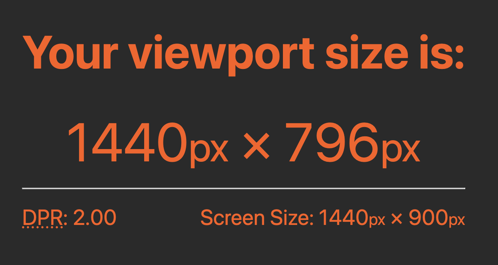

# MUI Toolpad docs

This is the documentation website of MUI Toolpad.

To start the docs site in development mode, from the project root, run:

```bash
yarn && yarn docs:dev
```

If you do not have yarn installed, select your OS and follow the instructions on the [Yarn website](https://yarnpkg.com/lang/en/docs/install/#mac-stable).

_DO NOT USE NPM, use Yarn to install the dependencies._

Visit the [MUI Toolpad documentation](https://mui.com/toolpad/getting-started/).

## How can I add a new demo to the documentation?

Please follow the [contributing guidelines](https://github.com/mui/material-ui/blob/HEAD/CONTRIBUTING.md).
on how to get started contributing to MUI.

## Screenshots

Some ground rules to ensure and maintain consistency in our documentation screenshots:

- Screenshots of the full browser viewport will always be at 1440x796 DPR:2
  You can check your size with https://whatismyviewport.com/. If all is well it should look like:

  

  _Note: This rule is not just about a consistent aspect ratio, it's also about maintaining consistent size between UI elements across screenshots. e.g. we want to aim at text always having the same size relative to the screenshot dimensions, or have the sidebar width relative to the screenshot width be the same everywhere._

- In order to maintain consistency across all screenshots we will use the same theme for editor and canvas when taking screenshots. As the default dark theme doesn't look that great in combination with the editor theme, we will use the light theme for all screenshots.
