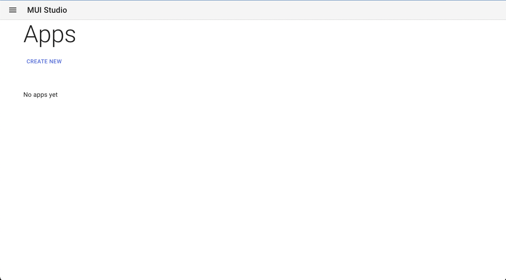
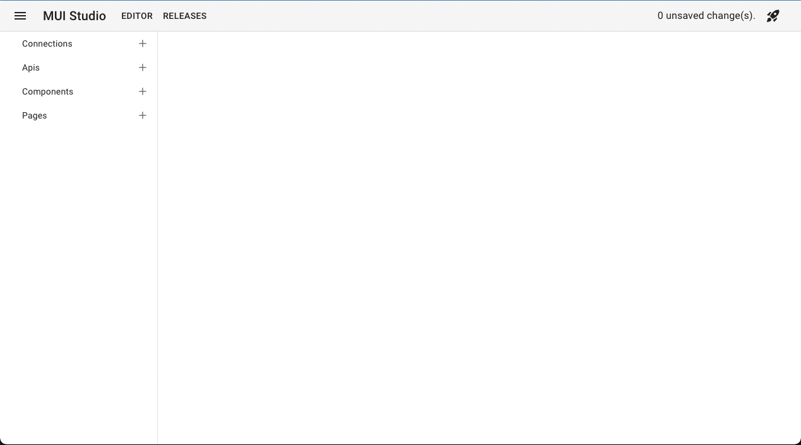
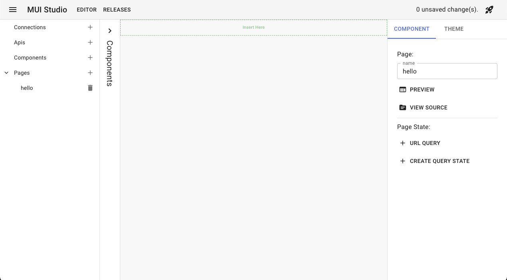
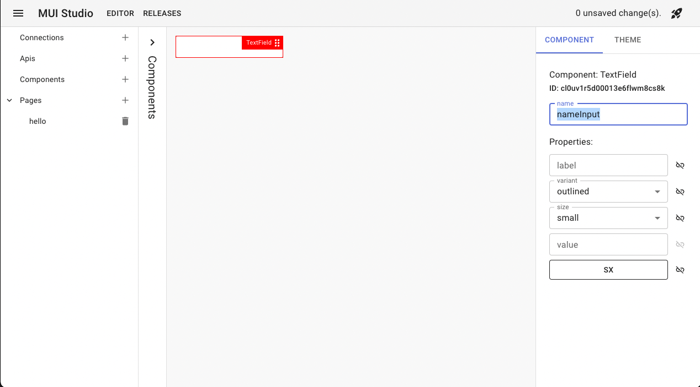
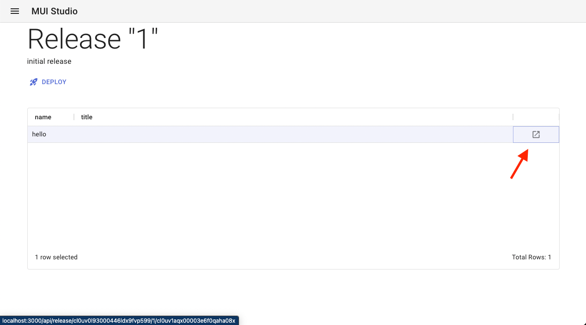

# Getting started

This page will guide you into creating your very first MUI Toolpad application. We will create a "hello world" type of application that will ask for a name and print a greeting.

## Prerequisites

Make sure you have a running MUI Toolpad instance. If you don't know how to do that, please follow the [setup instructions](./setup.md).

## Building your first application

1. Open MUI Toolpad by navigating to [http://localhost:3000/](http://localhost:3000/) if you went through the docker setup, or otherwise the url MUI Toolpad is hosted under. You'll be presented with an overview screen with all the applications available. If you've started from a fresh instance, there should be none present.

   

1. Click "create new" and choose a name for your application in the popup, then click "create". This will create a new MUI Toolpad application and the page will navigate to the application editor.

   

1. In the left navigation bar you will see all the objects that are present in this application. You'll see "connections", which represent credentials needed to connect to a datasource. "apis" allow you to query your data and make it available to pages. Next to the "pages" entry click + the icon to add a new page, give it a name and click "create". The page designer will open.

   

1. You are now in the page designer. You can access the components catalog by hovering the bar on the left side containing the word "components". When the catalog folds out, grab a "TextField" and drag into the canvas over the green box that says "insert here". When the box highlights, drop the TextField. An MUI TextField will now appear on the page canvas and the component properties editor opens. This input will be used to enter the name of the person we want to greet. In the component editor, change the name to "nameInput". We will use this name later on to refer to this TextField, so that we can bind properties to its value.

   

1. Open the component catalog again and drag a "Typography" component on the page. This will contain our greeting. In the component editor on the right hand side, locate the textfield for the "value" property. Try typing in this field. You'll notice the text on the screen changes. We can also make this value dynamic. To do this, click the link icon to the right of the textfield to open the binding editor.

   In the binding editor you can write any javascript expression. For instance, try typing the javascript string `'Hello everybody!'` and click "update binding". You'll notice that the text on the screen changes to "Hello everybody!".

   Now, change the javascript expression to `` `Hello ${nameInput.value}!` ``. Notice how we refer to our textField by the name "nameInput" that we set before. Now click "update binding" and close the binding editor.

   

1. Select the TextField and try typing your name. See how the Text follows?

   

## Deploying your first application

Now that we have our first simple application, let's make sure we can use it outside of the editor. We will deploy our application under a stable url.

1. First thing we need to do is to create a release for our application. When you create a release, the current state of the application is captured as a snapshot and stored. This snapshot will never change, we will always be able to access this snapshot and see the state of the application at the time that we took the snapshot. To create a release, click the launch icon in the top right corner of the menu bar. In the dialog that opens, write "Initial release" in the description field and click "create". You will be directed to the release's page. Here you'll get a list of all the pages present in this release. Go ahead and click the "open page" icon to see what your released page looks like.

   

1. You just created a versioned release of your application. Click the "deploy" button to host this version under the production url of your page. Navigate to the MUI Toolpad home to get an overview of your application and click the "open" button on the application you just deployed. You'll be presented with an overview of the pages available in this application. Click on a page to see the production version of the application.

   Now, go back to editing your application and change the binding of the Typography component to `` `Goodbye ${state.nameInput.value}!` ``. Create another release. After you've verified that the pages in this release are working correctly, click "deploy" to make this release the prodiction version of your application.
